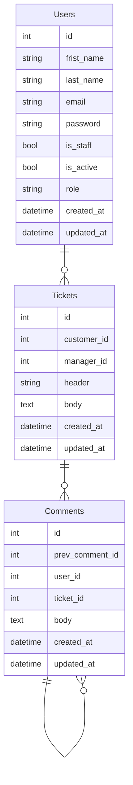
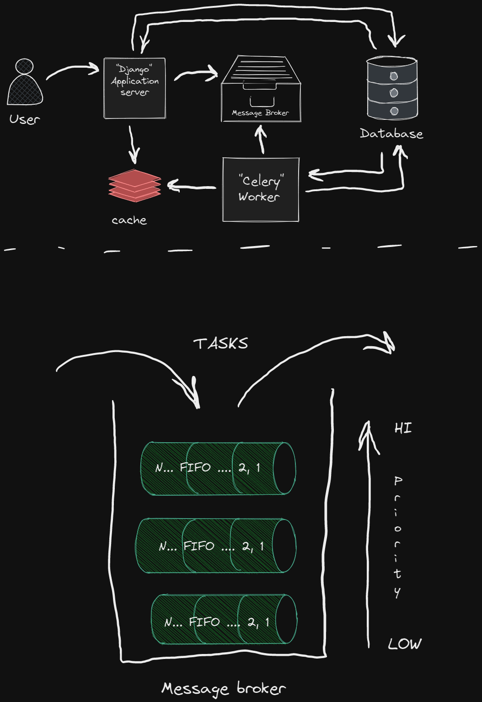

<h2><i><b>Adjust the application</i></b></h2>

<h3>Create `.env` file based on `.env.default`</h3>

```bash
# Unix
cp .env.default .env
```

<h3>Install deps</h3>

```bash
# Install pipenv
pip install pipenv

# Activate virtual env
pipenv shell

# Install deps
pipenv sync --dev
```

<h3>Additional</h3>

```bash
# Regenerate Pipfile.lock file
pipenv lock

# pipenv lock & pipenv sync
pipenv update
```

<h3>Staticfiles</h3>

```bash
# Create a directory with staticfiles
python src/mansge.py collectstatic
```

<h2><i>Framework</i></h2>

<a href="https://docs.djangoproject.com/en/4.1/" title="documentation"> Django 4.1.4</a>

<a href=https://www.django-rest-framework.org> Django REST framework 3.14.0</a>

<h2><i>Code quality tools</i></h2>

:mag: <a href="https://flake8.pycqa.org/en/latest/#/" title="documentation"> flake8 6.0.0</a>

:black_nib: <a href="https://black.readthedocs.io/en/stable/" title="documentation"> black 22.12.0</a>

:top: <a href="https://pycqa.github.io/isort//" title="documentation"> isort 5.10.1 </a>


<h2><i>Run using Docker Compose</h2></i>

```bash
docker-compose up -d
```

<h3>Usefull commands</h3>

<h4>Containers</h4>

:building_construction: Build images

"docker-compose build"

:arrow_forward: Start containers

"docker-compose up -d"

:stop_button: Stop containers

"docker-compose down"

:repeat: Restart containers

"docker-compose restart"

:grey_question: Check containers status

"docker-compose ps"


<h4>Logs</h4>

:shopping_cart: get all logs

"docker-compose logs"

:dart: get specific logs

"docker-compose logs app"

:game_die: get limited logs

"docker-compose logs --tail 10 app"

:kite: get flowed logs

"docker-compose logs -f app"


<h2>Application description</h2>

```bash

▾ users

    ├─ apps.py # Django apps configuration
    ├─ urls.py # pre-controller
    ├─ api.py # Endopints / post-controller
    ├─ models.py # Database tables mapper
    └─ admin.py # Database tables mapper
```

<h2>Deployment process</h2>

⬆️ Push the project to GitHub

🗃️ Create an EC2 instanse in AWS

🛂 Set-up necessary inbound and outbound rules

🌐 Connection to instanse in AWS

📦️ Install Docker and Docker Compose

🔐 Generate SSH keys for interaction with GitHub

⬇️ Pull the project into AWS instance

🏷️ Create .env file and define necessary variables accorrding to .env.default

🏗️ Build images ("docker-compose build")

🧑‍💻 Launch the project ("docker-compose up -d")

✅ Done

<h2>Database</h2>



<h2><i>Interaction between Django application server and background worker</i></h2>

